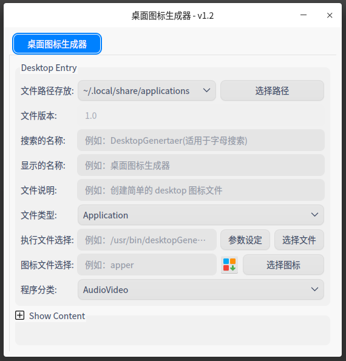

# z-tools-desktop-generator

* DesktopGenrater: desktop 图标生成器

  

## Build And Installation

* make run
* make package
* sudo dpkg -i  build/z-tools-desktop-generater*.deb

*You get the file "z-tools-desktop-generater\*. deb"*
