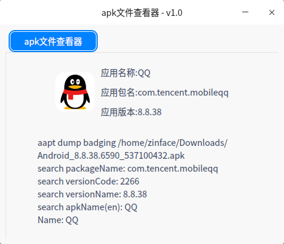

# z-tools base-apk-view
Linux toolbox under development

## Everything is born

> This is the nature of the future

## Installation

* mkdir build
* cd build
* cmake .. 
* make
* ./z-tools

## Build deb or tar.gz

* mkdir build
* cd build
* cmake .. ***or*** cmake .. -DBUILD_TYPE=TGZ
* make packae

*You get the file "\*. deb" or "\*.tar.gz"*

## screenshots

