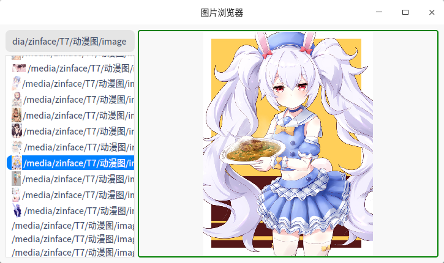

# z-tools-imagebrowser
图片浏览器: 用来浏览指定目录下及子目录下所有 jpg, png, svg 图片

## ScreenShot
1. 缩小的时候

    

2. 放大的时候

    

## Everything is born

> This is the nature of the future

## Compile

* mkdir build
* cd build
* cmake .. 
* make
* ./z-tools

## Build deb or tar.gz - Not Support

* mkdir build
* cd build
* cmake .. ***or*** cmake .. -DBUILD_TYPE=TGZ
* make packae

*You get the file "\*. deb" or "\*.tar.gz"*